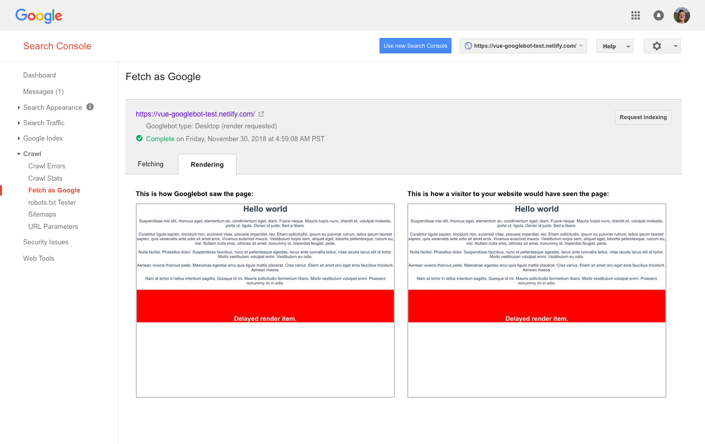

# Google indexing status

This repo contains a demo project using Vue, which is able to be rendered in the [fetch as Google](https://support.google.com/webmasters/answer/6066468?hl=en?utm_campaign=chrome_series_fetchgoogleweb_111717) tool.

## Resources

- [Search engine land report](https://searchengineland.com/tested-googlebot-crawls-javascript-heres-learned-220157)
- [SPA indexing in Google](https://medium.freecodecamp.org/seo-vs-react-is-it-neccessary-to-render-react-pages-in-the-backend-74ce5015c0c9) w examples

## Method

1.  The sample app is built and deployed somewhere world-accessible: https://vue-googlebot-test.netlify.com/
2.  The Fetch as Google tool is used to fetch & render the page.
3.  The results are rendered to the screen

## Results

Google indexes Javascript generated content (up to an arbitrary time limit).

1.  The heading & lorem ipsum are rendered immediately when the script loads
2.  The content in the red box loads after a 1 second delay.

## Conclusion & caveats

We can use client-only rendering for search engines.

It's unclear whether we can use async data requests, but other articles indicate this increases risk of timeouts and thus no content being indexed. Instead we should bundle the data and load it at runtime, so it is available to render without any delay.

Methods we might use include:

1.  In the page directly as a payload in a `<script type="text/template">`
2.  Using another external `<script src="">` element that inserts the content into the page.
3.  Bundling up the data with the Javascript for that page (this is inadvisable because it complicates caching rules)
